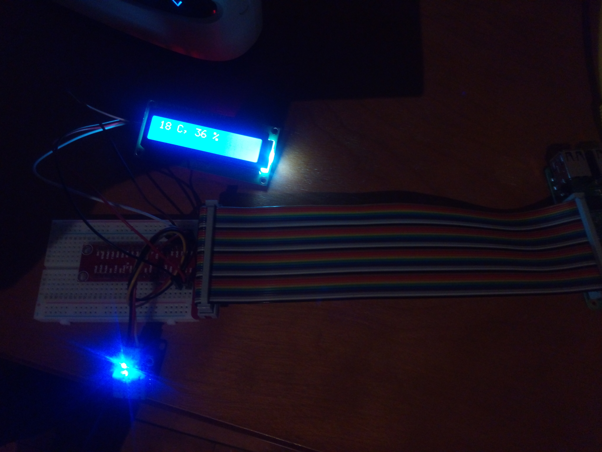

# Board Service

## Hardware




Components:
- 1 x rpi model 3b
- 1 x dht11 sensor
- 1 x lcd1602 i2c

This service will have the following responsibilities:

- acquiring data from sensors
- display information on lcd screen
- push information to domoticz

In order to talk to the lcd, the i2c interface must be enabled.

``` sh
sudo raspi-config
```
